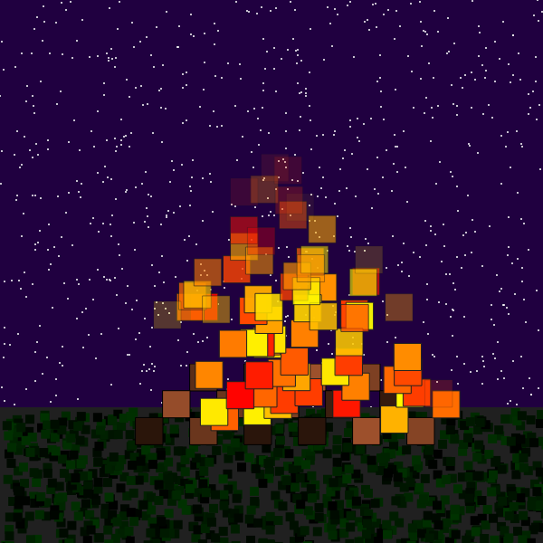

# Quiz 8
## Part1
A dynamic artwork using mosaic drawing has greatly inspired me, and I want to incorporate this technique of simplifying complex images into my design project. I believe that using low-resolution mosaic images to simplify the visual design does not sacrifice the visual effect; instead, it enhances the ability to draw dynamic graphics. If natural elements such as the ocean or the sky are drawn in the project, adjusting the density, size, color range, and speed of changes in the mosaic can make these natural elements vivid and interesting. This approach offers scalability while maintaining feasibility.
## Part2
p5.js can help implement this imaging technique. The fire squares simulate the natural flickering of flames using the sine function sin(), and their positions are determined by randomGaussian(), adding randomness and realism to the flames, achieving the desired dynamic effect of natural elements. Using lerpColor(), the fire squares smoothly transition between red and yellow, showing different brightness and color variations. This aligns with the goal of simulating natural elements. With the map() function, the fire squares gradually become transparent and eventually disappear. This fading effect mimics the natural decay of flames, helping achieve the expected natural extinction effect.
[Link Text](https://happycoding.io/tutorials/p5js/creating-classes/campfire)

